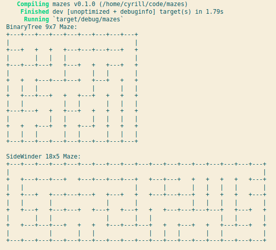

# Mazes
Mazes for fun and profit.

Algorithms implemented so far:
* [x] BinaryTree
* [x] SideWinder

# Building
* Use `nightly` toolchain
* Use `cargo run --features bevy/dynamic` for fast incremental compilation